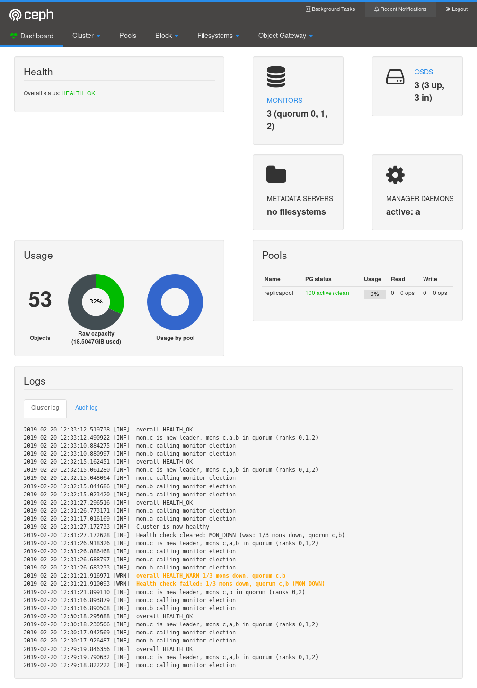

# Instal Rook

::: tip
Screencast: [https://asciinema.org/a/229605?t=155](https://asciinema.org/a/229605?autoplay=0&t=155)
:::

Install [Rook](https://rook.io/) Operator
([Ceph](https://ceph.com/) storage for k8s):

```bash
helm repo add rook-stable https://charts.rook.io/stable
helm install --wait --name rook-ceph --namespace rook-ceph-system rook-stable/rook-ceph
sleep 40
```

See how the rook-ceph-system should look like:

```bash
kubectl get svc,deploy,po --namespace=rook-ceph-system -o wide
```

Output:

```shell
NAME                                       READY   UP-TO-DATE   AVAILABLE   AGE     CONTAINERS           IMAGES             SELECTOR
deployment.extensions/rook-ceph-operator   1/1     1            1           3m36s   rook-ceph-operator   rook/ceph:v0.9.2   app=rook-ceph-operator

NAME                                      READY   STATUS    RESTARTS   AGE     IP               NODE                             NOMINATED NODE   READINESS GATES
pod/rook-ceph-agent-2bxhq                 1/1     Running   0          2m14s   192.168.250.12   pruzicka-k8s-istio-workshop-node02   <none>           <none>
pod/rook-ceph-agent-8h4p4                 1/1     Running   0          2m14s   192.168.250.11   pruzicka-k8s-istio-workshop-node01   <none>           <none>
pod/rook-ceph-agent-mq69r                 1/1     Running   0          2m14s   192.168.250.13   pruzicka-k8s-istio-workshop-node03   <none>           <none>
pod/rook-ceph-operator-7478c899b5-px2hc   1/1     Running   0          3m37s   10.244.2.3       pruzicka-k8s-istio-workshop-node02   <none>           <none>
pod/rook-discover-8ffj8                   1/1     Running   0          2m14s   10.244.2.4       pruzicka-k8s-istio-workshop-node02   <none>           <none>
pod/rook-discover-l56jj                   1/1     Running   0          2m14s   10.244.1.2       pruzicka-k8s-istio-workshop-node03   <none>           <none>
pod/rook-discover-q9xwp                   1/1     Running   0          2m14s   10.244.0.4       pruzicka-k8s-istio-workshop-node01   <none>           <none>
```

Create your Rook cluster:

```bash
kubectl create -f https://raw.githubusercontent.com/rook/rook/master/cluster/examples/kubernetes/ceph/cluster.yaml
```

Get the [Toolbox](https://rook.io/docs/rook/master/ceph-toolbox.html) with ceph commands:

```bash
kubectl create -f https://raw.githubusercontent.com/rook/rook/master/cluster/examples/kubernetes/ceph/toolbox.yaml
sleep 240
```

Check what was created in `rook-ceph` namespace:

```bash
kubectl get svc,deploy,po --namespace=rook-ceph -o wide
```

Output:

```shell
NAME                              TYPE        CLUSTER-IP      EXTERNAL-IP   PORT(S)    AGE     SELECTOR
service/rook-ceph-mgr             ClusterIP   10.103.36.128   <none>        9283/TCP   8m45s   app=rook-ceph-mgr,rook_cluster=rook-ceph
service/rook-ceph-mgr-dashboard   ClusterIP   10.99.173.58    <none>        8443/TCP   8m45s   app=rook-ceph-mgr,rook_cluster=rook-ceph
service/rook-ceph-mon-a           ClusterIP   10.102.39.160   <none>        6790/TCP   12m     app=rook-ceph-mon,ceph_daemon_id=a,mon=a,mon_cluster=rook-ceph,rook_cluster=rook-ceph
service/rook-ceph-mon-b           ClusterIP   10.102.49.137   <none>        6790/TCP   11m     app=rook-ceph-mon,ceph_daemon_id=b,mon=b,mon_cluster=rook-ceph,rook_cluster=rook-ceph
service/rook-ceph-mon-c           ClusterIP   10.96.25.143    <none>        6790/TCP   10m     app=rook-ceph-mon,ceph_daemon_id=c,mon=c,mon_cluster=rook-ceph,rook_cluster=rook-ceph

NAME                                    READY   UP-TO-DATE   AVAILABLE   AGE     CONTAINERS        IMAGES             SELECTOR
deployment.extensions/rook-ceph-mgr-a   1/1     1            1           9m33s   mgr               ceph/ceph:v13      app=rook-ceph-mgr,ceph_daemon_id=a,instance=a,mgr=a,rook_cluster=rook-ceph
deployment.extensions/rook-ceph-mon-a   1/1     1            1           12m     mon               ceph/ceph:v13      app=rook-ceph-mon,ceph_daemon_id=a,mon=a,mon_cluster=rook-ceph,rook_cluster=rook-ceph
deployment.extensions/rook-ceph-mon-b   1/1     1            1           11m     mon               ceph/ceph:v13      app=rook-ceph-mon,ceph_daemon_id=b,mon=b,mon_cluster=rook-ceph,rook_cluster=rook-ceph
deployment.extensions/rook-ceph-mon-c   1/1     1            1           10m     mon               ceph/ceph:v13      app=rook-ceph-mon,ceph_daemon_id=c,mon=c,mon_cluster=rook-ceph,rook_cluster=rook-ceph
deployment.extensions/rook-ceph-osd-0   1/1     1            1           8m34s   osd               ceph/ceph:v13      app=rook-ceph-osd,ceph-osd-id=0,rook_cluster=rook-ceph
deployment.extensions/rook-ceph-osd-1   1/1     1            1           8m33s   osd               ceph/ceph:v13      app=rook-ceph-osd,ceph-osd-id=1,rook_cluster=rook-ceph
deployment.extensions/rook-ceph-osd-2   1/1     1            1           8m33s   osd               ceph/ceph:v13      app=rook-ceph-osd,ceph-osd-id=2,rook_cluster=rook-ceph
deployment.extensions/rook-ceph-tools   1/1     1            1           12m     rook-ceph-tools   rook/ceph:master   app=rook-ceph-tools

NAME                                                             READY   STATUS      RESTARTS   AGE     IP               NODE                             NOMINATED NODE   READINESS GATES
pod/rook-ceph-mgr-a-669f5b47fc-sjvrr                             1/1     Running     0          9m33s   10.244.1.6       pruzicka-k8s-istio-workshop-node03   <none>           <none>
pod/rook-ceph-mon-a-784f8fb5b6-zcvjr                             1/1     Running     0          12m     10.244.0.5       pruzicka-k8s-istio-workshop-node01   <none>           <none>
pod/rook-ceph-mon-b-6dfbf486f4-2ktpm                             1/1     Running     0          11m     10.244.2.5       pruzicka-k8s-istio-workshop-node02   <none>           <none>
pod/rook-ceph-mon-c-6c85f6f44-j5wwv                              1/1     Running     0          10m     10.244.1.5       pruzicka-k8s-istio-workshop-node03   <none>           <none>
pod/rook-ceph-osd-0-6dd9cdc946-7th52                             1/1     Running     0          8m34s   10.244.1.8       pruzicka-k8s-istio-workshop-node03   <none>           <none>
pod/rook-ceph-osd-1-64cdd77897-9vdrh                             1/1     Running     0          8m33s   10.244.2.7       pruzicka-k8s-istio-workshop-node02   <none>           <none>
pod/rook-ceph-osd-2-67fcc446bd-skq52                             1/1     Running     0          8m33s   10.244.0.7       pruzicka-k8s-istio-workshop-node01   <none>           <none>
pod/rook-ceph-osd-prepare-pruzicka-k8s-istio-workshop-node01-z29hj   0/2     Completed   0          8m39s   10.244.0.6       pruzicka-k8s-istio-workshop-node01   <none>           <none>
pod/rook-ceph-osd-prepare-pruzicka-k8s-istio-workshop-node02-q8xqx   0/2     Completed   0          8m39s   10.244.2.6       pruzicka-k8s-istio-workshop-node02   <none>           <none>
pod/rook-ceph-osd-prepare-pruzicka-k8s-istio-workshop-node03-vbwxv   0/2     Completed   0          8m39s   10.244.1.7       pruzicka-k8s-istio-workshop-node03   <none>           <none>
pod/rook-ceph-tools-76c7d559b6-s6s4l                             1/1     Running     0          12m     192.168.250.12   pruzicka-k8s-istio-workshop-node02   <none>           <none>
```

Create a storage class based on the Ceph RBD volume plugin:

```bash
kubectl create -f https://raw.githubusercontent.com/rook/rook/master/cluster/examples/kubernetes/ceph/storageclass.yaml
sleep 5
```

Set `rook-ceph-block` as default Storage Class:

```bash
kubectl patch storageclass rook-ceph-block -p "{\"metadata\": {\"annotations\":{\"storageclass.kubernetes.io/is-default-class\":\"true\"}}}"
```

Check the Storage Classes:

```bash
kubectl describe storageclass
```

Output:

```shell
Name:                  rook-ceph-block
IsDefaultClass:        Yes
Annotations:           storageclass.kubernetes.io/is-default-class=true
Provisioner:           ceph.rook.io/block
Parameters:            blockPool=replicapool,clusterNamespace=rook-ceph,fstype=xfs
AllowVolumeExpansion:  <unset>
MountOptions:          <none>
ReclaimPolicy:         Delete
VolumeBindingMode:     Immediate
Events:                <none>
```

See the CephBlockPool:

```bash
kubectl describe cephblockpool --namespace=rook-ceph
```

Output:

```shell
Name:         replicapool
Namespace:    rook-ceph
Labels:       <none>
Annotations:  <none>
API Version:  ceph.rook.io/v1
Kind:         CephBlockPool
Metadata:
  Creation Timestamp:  2019-02-04T09:51:55Z
  Generation:          1
  Resource Version:    3171
  Self Link:           /apis/ceph.rook.io/v1/namespaces/rook-ceph/cephblockpools/replicapool
  UID:                 8163367d-2862-11e9-a470-fa163e90237a
Spec:
  Replicated:
    Size:  1
Events:    <none>
```

Check the status of your Ceph installation:

```bash
kubectl -n rook-ceph exec $(kubectl -n rook-ceph get pod -l "app=rook-ceph-tools" -o jsonpath="{.items[0].metadata.name}") -- ceph status
```

Output:

```shell
  cluster:
    id:     1f4458a6-f574-4e6c-8a25-5a5eef6eb0a7
    health: HEALTH_OK

  services:
    mon: 3 daemons, quorum c,a,b
    mgr: a(active)
    osd: 3 osds: 3 up, 3 in

  data:
    pools:   1 pools, 100 pgs
    objects: 0  objects, 0 B
    usage:   13 GiB used, 44 GiB / 58 GiB avail
    pgs:     100 active+clean
```

Ceph status:

```bash
kubectl -n rook-ceph exec $(kubectl -n rook-ceph get pod -l "app=rook-ceph-tools" -o jsonpath="{.items[0].metadata.name}") -- ceph osd status
```

Output:

```shell
+----+--------------------------------+-------+-------+--------+---------+--------+---------+-----------+
| id |              host              |  used | avail | wr ops | wr data | rd ops | rd data |   state   |
+----+--------------------------------+-------+-------+--------+---------+--------+---------+-----------+
| 0  | pruzicka-k8s-istio-workshop-node03 | 4302M | 15.0G |    0   |     0   |    0   |     0   | exists,up |
| 1  | pruzicka-k8s-istio-workshop-node02 | 4455M | 14.8G |    0   |     0   |    0   |     0   | exists,up |
| 2  | pruzicka-k8s-istio-workshop-node01 | 4948M | 14.3G |    0   |     0   |    0   |     0   | exists,up |
+----+--------------------------------+-------+-------+--------+---------+--------+---------+-----------+
```

Check the cluster usage status:

```bash
kubectl -n rook-ceph exec $(kubectl -n rook-ceph get pod -l "app=rook-ceph-tools" -o jsonpath="{.items[0].metadata.name}") -- ceph df
```

Output:

```shell
GLOBAL:
    SIZE       AVAIL      RAW USED     %RAW USED
    58 GiB     44 GiB       13 GiB         23.22
POOLS:
    NAME            ID     USED     %USED     MAX AVAIL     OBJECTS
    replicapool     1       0 B         0        40 GiB           0
```

Change listening port of [Ceph Dashboard](http://docs.ceph.com/docs/mimic/mgr/dashboard/)
([https://github.com/rook/rook/issues/2526](https://github.com/rook/rook/issues/2526)):

```bash
kubectl -n rook-ceph exec -it $(kubectl -n rook-ceph get pod -l "app=rook-ceph-tools" -o jsonpath='{.items[0].metadata.name}') -- ceph config set mgr mgr/dashboard/server_addr 0.0.0.0
sleep 5
kubectl delete pod -n rook-ceph  $(kubectl -n rook-ceph get pod -l app=rook-ceph-mgr -o jsonpath="{.items[0].metadata.name}")
sleep 5
```

::: warning
Run the following command on your local environment.
:::

Configure port forwarding to Ceph Dashboard:

```bash
kubectl -n rook-ceph port-forward $(kubectl -n rook-ceph get pod -l app=rook-ceph-mgr -o jsonpath="{.items[0].metadata.name}") 8443:8443 &
```

To access the Ceph Dashboard [https://localhost:8443](https://localhost:8443)
use username `admin` and password can be found by running:

```bash
kubectl -n rook-ceph get secret rook-ceph-dashboard-password -o yaml | grep "password:" | awk "{print \$2}" | base64 --decode
```

Ceph Dashboard ([https://localhost:8443](https://localhost:8443)):



.svg?sanitize=true
"Rook")
