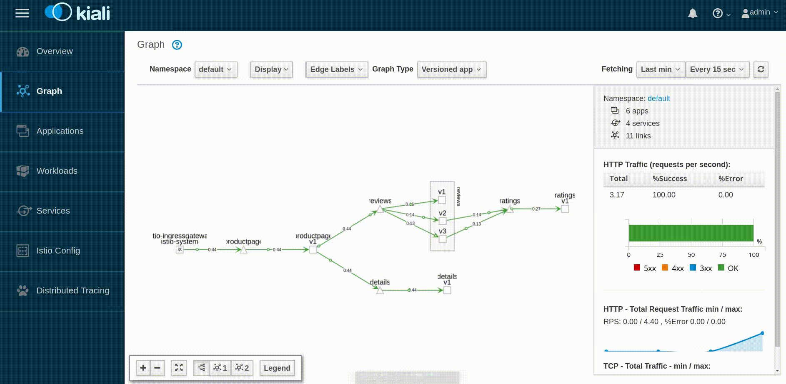
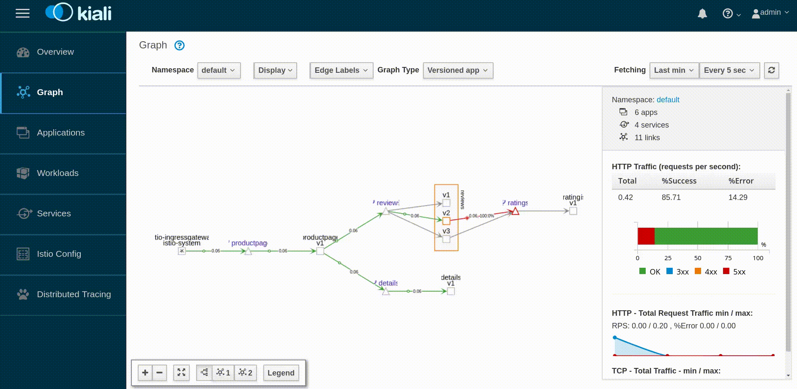

# Istio example

Check how Istio can be used and how it works...

## Deploy application into the default namespace where Istio is enabled

The Bookinfo application is broken into four separate microservices:

* `productpage` - the productpage microservice calls the details and reviews microservices to populate the page.
* `details` - the details microservice contains book information.
* `reviews` - the reviews microservice contains book reviews. It also calls the ratings microservice.
* `ratings` - the ratings microservice contains book ranking information that accompanies a book review.

There are 3 versions of the `reviews` microservice:

* Version `v1` - doesn’t call the **ratings service**.
* Version `v2` - calls the ratings service, and displays each rating as 1 to 5 **black stars**.
* Version `v3` - calls the ratings service, and displays each rating as 1 to 5 **red stars**.

[Bookinfo](https://istio.io/docs/examples/bookinfo/) application architecture


Deploy the demo of [Bookinfo](https://istio.io/docs/examples/bookinfo/) application:

```bash
kubectl apply -f samples/bookinfo/platform/kube/bookinfo.yaml
sleep 400
```

-----

Confirm all services and pods are correctly defined and running:

```bash
kubectl get svc,deployment,pods -o wide
```

Output:

```shell
NAME                  TYPE        CLUSTER-IP       EXTERNAL-IP   PORT(S)    AGE     SELECTOR
service/details       ClusterIP   10.103.142.153   <none>        9080/TCP   4m21s   app=details
service/kubernetes    ClusterIP   10.96.0.1        <none>        443/TCP    75m     <none>
service/productpage   ClusterIP   10.111.62.53     <none>        9080/TCP   4m17s   app=productpage
service/ratings       ClusterIP   10.110.22.215    <none>        9080/TCP   4m20s   app=ratings
service/reviews       ClusterIP   10.100.73.81     <none>        9080/TCP   4m19s   app=reviews

NAME                                   READY   UP-TO-DATE   AVAILABLE   AGE     CONTAINERS    IMAGES                                         SELECTOR
deployment.extensions/details-v1       1/1     1            1           4m21s   details       istio/examples-bookinfo-details-v1:1.8.0       app=details,version=v1
deployment.extensions/productpage-v1   1/1     1            1           4m16s   productpage   istio/examples-bookinfo-productpage-v1:1.8.0   app=productpage,version=v1
deployment.extensions/ratings-v1       1/1     1            1           4m20s   ratings       istio/examples-bookinfo-ratings-v1:1.8.0       app=ratings,version=v1
deployment.extensions/reviews-v1       1/1     1            1           4m19s   reviews       istio/examples-bookinfo-reviews-v1:1.8.0       app=reviews,version=v1
deployment.extensions/reviews-v2       1/1     1            1           4m18s   reviews       istio/examples-bookinfo-reviews-v2:1.8.0       app=reviews,version=v2
deployment.extensions/reviews-v3       1/1     1            1           4m18s   reviews       istio/examples-bookinfo-reviews-v3:1.8.0       app=reviews,version=v3

NAME                                      READY   STATUS    RESTARTS   AGE     IP            NODE                             NOMINATED NODE   READINESS GATES
pod/details-v1-68c7c8666d-pvrx6           2/2     Running   0          4m21s   10.244.1.20   pruzicka-k8s-istio-workshop-node03   <none>           <none>
pod/elasticsearch-operator-sysctl-297j8   1/1     Running   0          45m     10.244.2.8    pruzicka-k8s-istio-workshop-node02   <none>           <none>
pod/elasticsearch-operator-sysctl-bg8rn   1/1     Running   0          45m     10.244.1.10   pruzicka-k8s-istio-workshop-node03   <none>           <none>
pod/elasticsearch-operator-sysctl-vwvbl   1/1     Running   0          45m     10.244.0.8    pruzicka-k8s-istio-workshop-node01   <none>           <none>
pod/productpage-v1-54d799c966-2b4ss       2/2     Running   0          4m16s   10.244.1.23   pruzicka-k8s-istio-workshop-node03   <none>           <none>
pod/ratings-v1-8558d4458d-ln99n           2/2     Running   0          4m20s   10.244.1.21   pruzicka-k8s-istio-workshop-node03   <none>           <none>
pod/reviews-v1-cb8655c75-hpqfg            2/2     Running   0          4m19s   10.244.1.22   pruzicka-k8s-istio-workshop-node03   <none>           <none>
pod/reviews-v2-7fc9bb6dcf-snshx           2/2     Running   0          4m18s   10.244.2.19   pruzicka-k8s-istio-workshop-node02   <none>           <none>
pod/reviews-v3-c995979bc-wcql9            2/2     Running   0          4m18s   10.244.0.12   pruzicka-k8s-istio-workshop-node01   <none>           <none>
```

Check the container details - you should see also container `istio-proxy` next to `productpage`:

```bash
kubectl describe pod -l app=productpage
kubectl logs $(kubectl get pod -l app=productpage -o jsonpath="{.items[0].metadata.name}") istio-proxy --tail=5
```

Define the [Istio gateway](https://istio.io/docs/reference/config/istio.networking.v1alpha3/#Gateway) for the application:

```bash
cat samples/bookinfo/networking/bookinfo-gateway.yaml
kubectl apply -f samples/bookinfo/networking/bookinfo-gateway.yaml
sleep 5
```

Confirm the gateway has been created:

```bash
kubectl get gateway,virtualservice
```

Output:

```shell
NAME                                           AGE
gateway.networking.istio.io/bookinfo-gateway   11s

NAME                                          AGE
virtualservice.networking.istio.io/bookinfo   12s
```

Determining the ingress IP and ports when using a node port:

```bash
export INGRESS_PORT=$(kubectl -n istio-system get service istio-ingressgateway -o jsonpath="{.spec.ports[?(@.name==\"http2\")].nodePort}")
export SECURE_INGRESS_PORT=$(kubectl -n istio-system get service istio-ingressgateway -o jsonpath="{.spec.ports[?(@.name==\"https\")].nodePort}")
export INGRESS_HOST=$(kubectl get po -l istio=ingressgateway -n istio-system -o "jsonpath={.items[0].status.hostIP}")
if test -f ../../terraform.tfstate && grep -q vms_public_ip ../../terraform.tfstate; then
  export INGRESS_HOST=$(terraform output -json -state=../../terraform.tfstate | jq -r ".vms_public_ip.value[0]")
fi
export GATEWAY_URL=$INGRESS_HOST:$INGRESS_PORT
echo "$INGRESS_PORT | $SECURE_INGRESS_PORT | $INGRESS_HOST | $GATEWAY_URL | http://$GATEWAY_URL/productpage"
```

Output:

```shell
31380 | 31390 | 172.16.242.170 | 172.16.242.170:31380
```

-----

Confirm the app is running:

```bash
curl -o /dev/null -s -w "%{http_code}\n" -A "Mozilla/5.0 (iPhone; U; CPU iPhone OS 4_3_3 like Mac OS X; en-us) AppleWebKit/533.17.9 (KHTML, like Gecko) Version/5.0.2 Mobile/8J2 Safari/6533.18.5" http://${GATEWAY_URL}/productpage
```

Output:

```shell
200
```

Create default [destination rules](https://istio.io/docs/reference/config/istio.networking.v1alpha3/#DestinationRule) (subsets) for the Bookinfo services:

```bash
kubectl apply -f samples/bookinfo/networking/destination-rule-all.yaml
```

Display the destination rules:

```bash
kubectl get destinationrules -o yaml
```

Generate some traffic for next 5 minutes to gether some data:

```bash
siege --log=/tmp/siege --concurrent=1 -q --internet --time=5M $GATEWAY_URL/productpage &
```

Open the browser with these pages:

* [http://localhost:8088/force/forcegraph.html](http://localhost:8088/force/forcegraph.html)
* [http://localhost:8088/dotviz](http://localhost:8088/dotviz)
* [http://localhost:20001](http://localhost:20001) (admin/admin)
* [http://localhost:16686](http://localhost:16686)
* [https://localhost:5601/app/kibana](https://localhost:5601/app/kibana)
* [http://localhost:3000](http://localhost:3000) (Grafana -> Home -> Istio -> Istio Performance Dashboard, Istio Service Dashboard, Istio Workload Dashboard )

* Open the Bookinfo site in your browser `http://$GATEWAY_URL/productpage` and refresh the page several times - you should see different versions of reviews shown in productpage, presented in a **round robin style** (red stars, black stars, no stars), since we haven’t yet used Istio to control the version routing.


* Check the flows in [Kiali](https://www.kiali.io/) graph



-----

## Configuring Request Routing

[https://istio.io/docs/tasks/traffic-management/request-routing/](https://istio.io/docs/tasks/traffic-management/request-routing/)

Apply the virtual services which will route all traffic to **v1** of each microservice:

```bash
kubectl apply -f samples/bookinfo/networking/virtual-service-all-v1.yaml
```

Display the defined routes:

```bash
kubectl get virtualservices -o yaml
```

Output:

```yaml
apiVersion: networking.istio.io/v1alpha3
kind: VirtualService
metadata:
  name: details
  ...
spec:
  hosts:
  - details
  http:
  - route:
    - destination:
        host: details
        subset: v1
---
apiVersion: networking.istio.io/v1alpha3
kind: VirtualService
metadata:
  name: productpage
  ...
spec:
  gateways:
  - bookinfo-gateway
  - mesh
  hosts:
  - productpage
  http:
  - route:
    - destination:
        host: productpage
        subset: v1
---
apiVersion: networking.istio.io/v1alpha3
kind: VirtualService
metadata:
  name: ratings
  ...
spec:
  hosts:
  - ratings
  http:
  - route:
    - destination:
        host: ratings
        subset: v1
---
apiVersion: networking.istio.io/v1alpha3
kind: VirtualService
metadata:
  name: reviews
  ...
spec:
  hosts:
  - reviews
  http:
  - route:
    - destination:
        host: reviews
        subset: v1
```

* Open the Bookinfo site in your browser `http://$GATEWAY_URL/productpage` and notice that the reviews part of the page displays with no rating stars, no matter how many times you refresh.


-----

## Route based on user identity

[https://istio.io/docs/tasks/traffic-management/request-routing/#route-based-on-user-identity](https://istio.io/docs/tasks/traffic-management/request-routing/#route-based-on-user-identity)

All traffic from a user named `jason` will be routed to the service `reviews:v2` by forwarding HTTP requests with custom end-user header to the appropriate reviews service.

Enable user-based routing:

```bash
kubectl apply -f samples/bookinfo/networking/virtual-service-reviews-test-v2.yaml
```

Confirm the rule is created:

```bash
kubectl get virtualservice reviews -o yaml
```

Output:

```yaml
apiVersion: networking.istio.io/v1alpha3
kind: VirtualService
metadata:
  name: reviews
  ...
spec:
  hosts:
  - reviews
  http:
  - match:
    - headers:
        end-user:
          exact: jason
    route:
    - destination:
        host: reviews
        subset: v2
  - route:
    - destination:
        host: reviews
        subset: v1
```

* On the /productpage of the Bookinfo app, log in as user `jason` and refresh the browser.

* Log in as another user (pick any name you wish) and refresh the browser


You can do the same with `user-agent header` or `URI` for example:

```yaml
  ...
  http:
    - match:
      - headers:
        user-agent:
          regex: '.*Firefox.*'
  ...
  http:
    - match:
      - uri:
        prefix: /api/v1
  ...
```

-----

## Injecting an HTTP delay fault

[https://istio.io/docs/tasks/traffic-management/fault-injection/#injecting-an-http-delay-fault](https://istio.io/docs/tasks/traffic-management/fault-injection/#injecting-an-http-delay-fault)

Inject a 7s delay between the `reviews:v2` and ratings microservices for user `jason`:

```bash
kubectl apply -f samples/bookinfo/networking/virtual-service-ratings-test-delay.yaml
```

Confirm the rule was created:

```bash
kubectl get virtualservice ratings -o yaml
```

Output:

```yaml
apiVersion: networking.istio.io/v1alpha3
kind: VirtualService
metadata:
  name: ratings
  ...
spec:
  hosts:
  - ratings
  http:
  - fault:
      delay:
        fixedDelay: 7s
        percent: 100
    match:
    - headers:
        end-user:
          exact: jason
    route:
    - destination:
        host: ratings
        subset: v1
  - route:
    - destination:
        host: ratings
        subset: v1
```

* On the `/productpage`, log in as user `jason` adn you should see:

```text
Error fetching product reviews!
Sorry, product reviews are currently unavailable for this book.
```


* Open the Developer Tools menu (F12) -> Network tab - webpage actually loads in about 6 seconds.

The following example introduces a **5 second delay** in **10%** of the requests to the `v1` version of the `ratings` microservice:

```yaml
apiVersion: networking.istio.io/v1alpha3
kind: VirtualService
metadata:
  name: ratings
spec:
  hosts:
  - ratings
  http:
  - fault:
      delay:
        percent: 10
        fixedDelay: 5s
    route:
    - destination:
        host: ratings
        subset: v1
```

-----

## Injecting an HTTP abort fault

[https://istio.io/docs/tasks/traffic-management/fault-injection/#injecting-an-http-abort-fault](https://istio.io/docs/tasks/traffic-management/fault-injection/#injecting-an-http-abort-fault)

Let's ntroduce an HTTP abort to the ratings microservices for the test user `jason`.

Create a fault injection rule to send an HTTP abort for user `jason`:

```bash
kubectl apply -f samples/bookinfo/networking/virtual-service-ratings-test-abort.yaml
```

Confirm the rule was created:

```bash
kubectl get virtualservice ratings -o yaml
```

Output:

```yaml
apiVersion: networking.istio.io/v1alpha3
kind: VirtualService
metadata:
  name: ratings
  ...
spec:
  hosts:
  - ratings
  http:
  - fault:
      abort:
        httpStatus: 500
        percent: 100
    match:
    - headers:
        end-user:
          exact: jason
    route:
    - destination:
        host: ratings
        subset: v1
  - route:
    - destination:
        host: ratings
        subset: v1
```

* On the `/productpage`, log in as user `jason` - the page loads immediately and the product ratings not available message appears.


* Check the flows in Kiali graph



The following example returns an **HTTP 400** error code for **10%** of the requests to the `ratings` service `v1`:

```yaml
apiVersion: networking.istio.io/v1alpha3
kind: VirtualService
metadata:
  name: ratings
spec:
  hosts:
  - ratings
  http:
  - fault:
      abort:
        percent: 10
        httpStatus: 400
    route:
    - destination:
        host: ratings
        subset: v1
```

-----

## Weight-based routing

[https://istio.io/docs/tasks/traffic-management/traffic-shifting/#apply-weight-based-routing](https://istio.io/docs/tasks/traffic-management/traffic-shifting/#apply-weight-based-routing)

In **Canary Deployments**, newer versions of services are incrementally rolled out to users to minimize the risk and impact of any bugs introduced by the newer version.

Route a percentage of traffic to one service or another - send **%50** of traffic to `reviews:v1` and **%50** to `reviews:v3` and finally complete the migration by sending %100 of traffic to `reviews:v3`.

Route all traffic to the `reviews:v1` version of each microservice:

```bash
kubectl apply -f samples/bookinfo/networking/virtual-service-all-v1.yaml
```

Transfer 50% of the traffic from `reviews:v1` to `reviews:v3`:

```bash
kubectl apply -f samples/bookinfo/networking/virtual-service-reviews-50-v3.yaml
```

Confirm the rule was replaced:

```bash
kubectl get virtualservice reviews -o yaml
```

Output:

```yaml
apiVersion: networking.istio.io/v1alpha3
kind: VirtualService
metadata:
  name: reviews
  ...
spec:
  hosts:
  - reviews
  http:
  - route:
    - destination:
        host: reviews
        subset: v1
      weight: 50
    - destination:
        host: reviews
        subset: v3
      weight: 50
```

* Refresh the `/productpage` in your browser and you now see **red** colored star ratings approximately **50%** of the time.

* Check the flows in Kiali graph


-----

Assuming you decide that the `reviews:v3` microservice is stable, you can route **100%** of the traffic to `reviews:v3` by applying this virtual service.

```bash
kubectl apply -f samples/bookinfo/networking/virtual-service-reviews-v3.yaml
```

* When you refresh the `/productpage` you will always see book reviews with **red** colored star ratings for **each** review.


-----

## Mirroring

[https://istio.io/docs/tasks/traffic-management/mirroring/](https://istio.io/docs/tasks/traffic-management/mirroring/)

Mirroring sends a copy of live traffic to a mirrored service.

First all traffic will go to `reviews:v1`, then the rule will be applied to mirror a portion of traffic to `reviews:v2`.

Apply the virtual services which will route all traffic to `v1` of each microservice:

```bash
kubectl apply -f samples/bookinfo/networking/virtual-service-all-v1.yaml
```

Change the route rule to mirror traffic to `v2`:

```bash
cat << EOF | kubectl apply -f -
apiVersion: networking.istio.io/v1alpha3
kind: VirtualService
metadata:
  name: reviews
spec:
  hosts:
    - reviews
  http:
  - route:
    - destination:
        host: reviews
        subset: v1
      weight: 100
    mirror:
      host: reviews
      subset: v2
EOF
```

-----

Check the logs on both pods `reviews:v1` and `reviews:v2`:

```shell
byobu
byobu-tmux select-pane -t 0
byobu-tmux split-window -v
byobu-tmux select-pane -t 0
```

```bash
kubectl logs $(kubectl get pod -l app=reviews,version=v1 -o jsonpath="{.items[0].metadata.name}") istio-proxy --tail=10
kubectl logs $(kubectl get pod -l app=reviews,version=v2 -o jsonpath="{.items[0].metadata.name}") istio-proxy --tail=10
```

* Do a simple query by refreshing the page in the web browser.

* Check the flows in Kiali graph


-----
